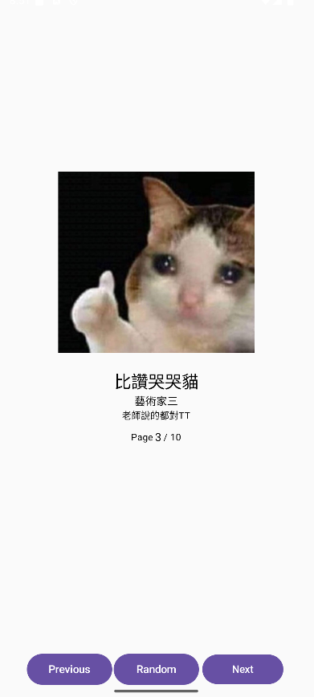

# 🎨 Art Gallery App — 互動式畫作瀏覽器

這是我的 Android 應用程式作品「Art Gallery App」，提供一個直覺且具有豐富互動效果的畫作瀏覽體驗。



---

## 📌 功能特色

- 🖼️ **畫作瀏覽**
    - 支援「上一頁」、「下一頁」、「隨機跳轉」操作
    - 支援左右滑動手勢切換畫作
- 💡 **提示功能**
    - 每個按鈕附帶 Tooltip 說明
    - Tooltip 長按觸發，交互友善
- 🎨 **動畫效果**
    - 畫面切換滑動動畫，依切換方向決定動畫方向
    - 頁數變化數字滑動動畫（僅變動數字部分）
    - Random 按鈕點擊時數字快速閃爍特效，像抽卡效果
    - 隨機跳轉時按鈕旋轉動畫
    - 頁面切換時圖片輕微震動，視覺層次感提升
    - 圖片滑動時視差效果，增強互動感
- 🎨 **版面優化**
    - 版面整體置中，按鈕排版平衡，交互體驗流暢

---

## 🚀 技術棧

- **語言**：Kotlin 2.0.0
- **框架**：Jetpack Compose (Material 3)
- **動畫庫**：Compose Animation API（`AnimatedContent`, `Animatable` 等）
- **手勢偵測**：`detectDragGestures`
- **設計理念**：現代化、動態感強烈、使用者友善

---

## 🧩 使用方式

1. ✅ 開啟 Android Studio，導入專案
2. ✅ 確保環境：
    - Kotlin 2.0.0
    - Compose BOM 2024.04.00
3. ✅ 點擊「Run」，執行模擬器或真機測試
4. ✅ 使用滑動手勢或按鈕進行畫作瀏覽

---

## ✨ 開發過程說明（Prompt）

**目標設計：**
> 設計一款互動式畫作瀏覽器，體驗感與視覺效果兼具。

**開發步驟：**
1. 設計畫面排版，使用 `Column` + `Row` 實現上下分層結構。
2. 加入畫作資料列表，包含圖片、標題、藝術家、描述。
3. 實作滑動手勢偵測，使用 `detectDragGestures` 處理橫向滑動。
4. 加入頁面切換動畫，根據頁面切換方向設定對應動畫效果。
5. 按鈕功能實作：上一頁、下一頁、隨機跳轉，並加入 Tooltip。
6. 「Random」隨機跳轉增加按鈕旋轉動畫。
7. 頁數顯示優化，拆分動靜態部分，數字變化時滑動＋縮放動畫。
8. 「Random」隨機跳轉增加數字閃爍效果，提升趣味性。
9. 每次頁面變動時圖片加入輕微震動效果。
10. 圖片滑動過程加入視差效果，增加互動層次。
11. 排版 spacing 微調，視覺平衡優化。
12. 撰寫完整 README，準備交付！

---

## 🖼️ 專案截圖

請助教參考以下畫面：

> 📂 提交時請放入資料夾 `screenshots/`  
> ✅ 建議至少準備：
> - 畫面主視覺
> - Tooltip 展示
> - Random 效果截圖
> - 頁數變化效果截圖

---

## 📦 提交注意事項

- ✅ 已去除 build 相關 Object 或可執行檔案
- ✅ `readme.md` 說明文件已包含在專案根目錄
- ✅ 專案壓縮為 `.zip` 後提交

---

## 💡 開發心得

在這次開發中，我嘗試了許多 Jetpack Compose 動畫與互動效果：
- 學會了如何結合 `AnimatedContent` 和 `Animatable`，實現視覺層次豐富的交互體驗。
- 在滑動手勢偵測方面，利用 `detectDragGestures` 成功實現了滑動翻頁的功能，同時加入圖片視差與震動效果，使整體更具動態感。
- 在 UI 視覺呈現上，將頁數顯示做了精細拆分，讓畫面層次感更加突出。
- **特別發現**：  
  在實作長按 Tooltip 時，發現如果僅使用長按觸發 Tooltip，容易與點擊事件衝突，會出現「點擊和長按重複觸發」的問題。  
  透過加上邏輯控制，像這樣：
  ```kotlin
  onClick = {
      if (!isLongPress) {
          onClick()
      }
      isLongPress = false
      isPressing = false
  }

感謝助教與老師，這次專案過程非常有收穫 🎉

---

## 🙏 感謝閱讀！

如有任何問題歡迎聯繫詢問，期待您的回饋！🙂
